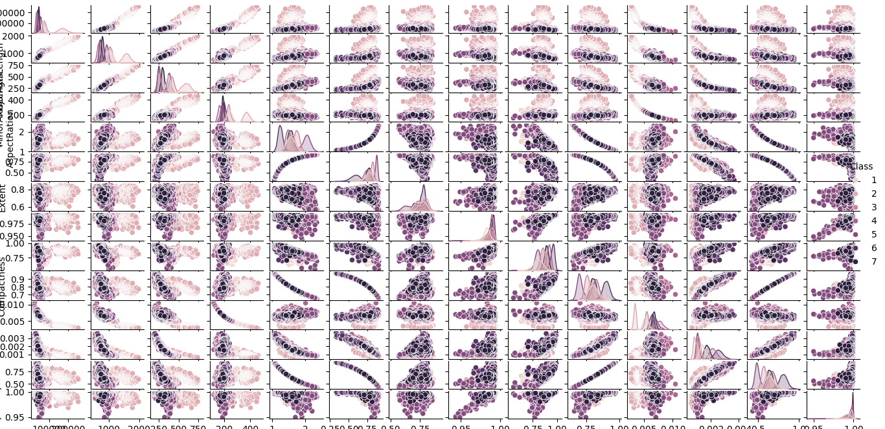
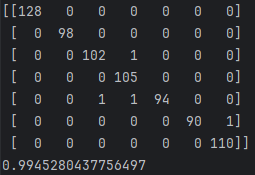
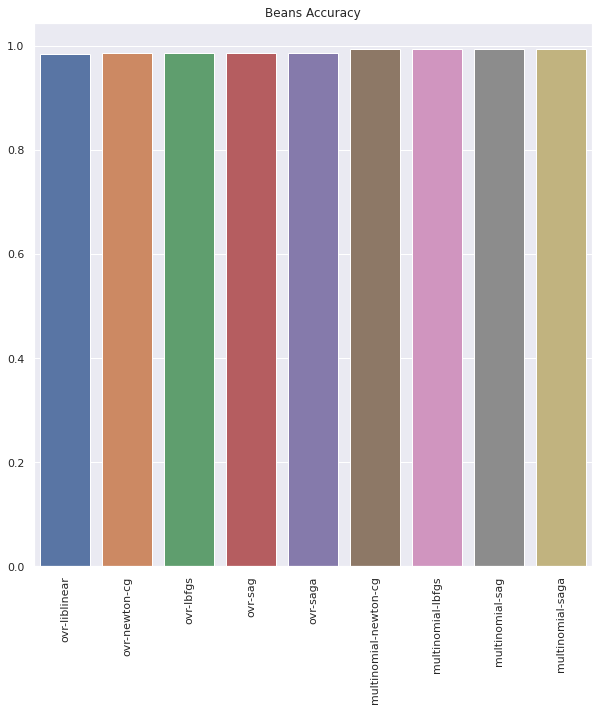
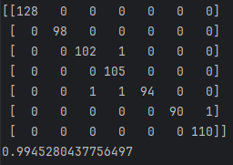
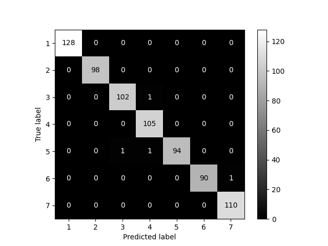

# Multinomial Logistic Bean Classification

This project aims to classify seven types of dry beans based on computer vision-derived features. Data preprocessing, visualization, and multinomial logistic regression are employed to address class imbalance and develop an accurate classification model.

## Table of Contents

- [Introduction](#intro)
- [Data Loading and Initial Inspection](#load)
- [Data Preprocessing](#pre)
- [Under-sampling for Imbalanced Classes](#under)
- [Conversion to Numeric Labels](#num)
- [Exploratory Data Analysis](#eda)
- [Data Visualization](#vis)
- [Data Splitting and Scaling](#split)
- [Multiclass Model Creation](#multi)
- [Model Parameter Tuning and Evaluation](#tuning)
- [Results Evaluation and Visualization](#results)

## [Introduction](#intro)

This project focuses on the classification of seven distinct types of dry beans using a multinomial logistic regression model. The dataset encompasses features related to the beans' form, size, shape, and structure, collected through computer vision. The primary objective is to develop a robust model that can effectively differentiate these beans based on their unique characteristics.

## [Data Loading and Initial Inspection](#load)

In this initial step, we load the dataset, examine the first few rows, check for unique class labels, and gather preliminary statistics about the data.

```python
path = r'..\Dry_Bean.csv'
df = pd.read_csv(path)
df.head(5)
df['Class'].unique()
df.describe()
```

## [Data Preprocessing](#pre)

Data preprocessing is crucial to ensure data quality. Here, we remove duplicate records to maintain data consistency and check for any missing values in the dataset.

```python
df.drop_duplicates(inplace=True)
df.isnull().sum()
```

## [Under-sampling for Imbalanced Classes](#under)

Addressing class imbalance is essential for creating a balanced dataset. We visualize the class distribution using a countplot to identify the imbalance issue.

```python
color_palette = ['red', 'blue', 'yellow', 'purple', 'cyan', 'orange', 'gold']
sns.countplot(x=df.Class, palette=color_palette)
plt.show()
```


```python
undersample = RandomUnderSampler(random_state=42)

X = df.drop('Class', axis=1)
y = df.Class

X_over, y_over = undersample.fit_resample(X, y)

sns.countplot(x=y_over, palette=color_palette)
plt.show()
```


## [Conversion to Numeric Labels](#num)

In this step, we convert the string-based class labels into numeric values. This transformation is essential for machine learning algorithms to work with the target variable.

```python
y_over.replace(['BARBUNYA', 'BOMBAY', 'CALI', 'DERMASON', 'HOROZ', 'SEKER', 'SIRA'], [1, 2, 3, 4, 5, 6, 7], inplace=True)
```

## [Exploratory Data Analysis](#eda)

EDA provides insights into data relationships. We create a correlation heatmap to visualize feature interactions, which guides feature selection.

```python
plt.figure(figsize=(15, 10))
sns.heatmap(df_dea.corr(), annot=True)
plt.show()
```


## [Data Visualization](#vis)

Data visualization is a powerful tool for understanding the dataset. The pairplot, color-coded by class, helps us discern how different features distinguish bean classes.

```python
plt.figure(figsize=(15, 10))
sns.pairplot(df_dea, hue='Class')
plt.show()
```



## [Data Splitting and Scaling](#split)

Data splitting prepares the dataset for modeling by creating training and testing sets. Scaling with StandardScaler ensures that features are on a consistent scale.

```python
X_train, X_test, y_train, y_test = train_test_split(X_over, y_over, random_state=42, shuffle=True, test_size=0.2)
st_x = StandardScaler()
X_train = st_x.fit_transform(X_train)
X_test = st_x.fit_transform(X_test)
```

## [Multiclass Model Creation](#multi)

In this step, we create a multinomial logistic regression model to classify the dry bean classes. We use the LogisticRegression class from scikit-learn, specifying the solver ('saga') and multiclass strategy ('multinomial'). We then fit the model to the training data and evaluate its performance on the test set using a confusion matrix and accuracy score.

```python
def logistic_model(c_, solver_, multiclass_):
    l_r_m_ = LogisticRegression(random_state=42, solver=solver_, multi_class=multiclass_, n_jobs=-1, C=c_)
    return l_r_m

model = logistic_model(1, 'saga', 'multinomial')
model.fit(X_train, y_train)
predictions = model.predict(X_test)
print(confusion_matrix(y_test, predictions))
print(accuracy_score(y_test, predictions))
```



## [Model Parameter Tuning and Evaluation](#tuning)

In this step, we explore different combinations of solver algorithms and multiclass strategies to fine-tune the model. We iteratively train and evaluate logistic regression models with various parameter settings, aiming to find the best combination that yields the highest accuracy.

```python
multiclass = ['ovr', 'multinomial']
solver_list = ['liblinear', 'newton-cg', 'lbfgs', 'sag', 'saga']
scores = []
params = []

for i in multiclass:
    for j in solver_list:
        try:
            model = logistic_model(1, i, j)
            model.fit(X_train, y_train)
            predictions = model.predict(X_test)
            params.append(i + '-' + j)
            accuracy = accuracy_score(y_test, predictions)
            scores.append(accuracy)
        except:
            None
```

## [Results Evaluation and Visualization](#results)

In the final step, we visualize the results of our model parameter tuning by creating a barplot of accuracy scores for different solver strategies. This helps us identify the most effective configuration. We also generate a confusion matrix and display it with label annotations to assess the model's performance.

```python
fig = plt.figure(figsize=(10, 10))
sns.barplot(x=params, y=scores).set_title('Beans Accuracy')
plt.xticks(rotation=90)
plt.show()
```



```python
model = logistic_model(1, 'newton-cg', 'multinomial')
model.fit(X_train, y_train)
predictions = model.predict(X_test)
print(confusion_matrix(y_test, predictions))
print(accuracy_score(y_test, predictions))
```



```python
cm = confusion_matrix(y_test, predictions, labels=model.classes_)
disp = ConfusionMatrixDisplay(confusion_matrix=cm, display_labels=model.classes_)
disp.plot(cmap='gray')
plt.show()
```


